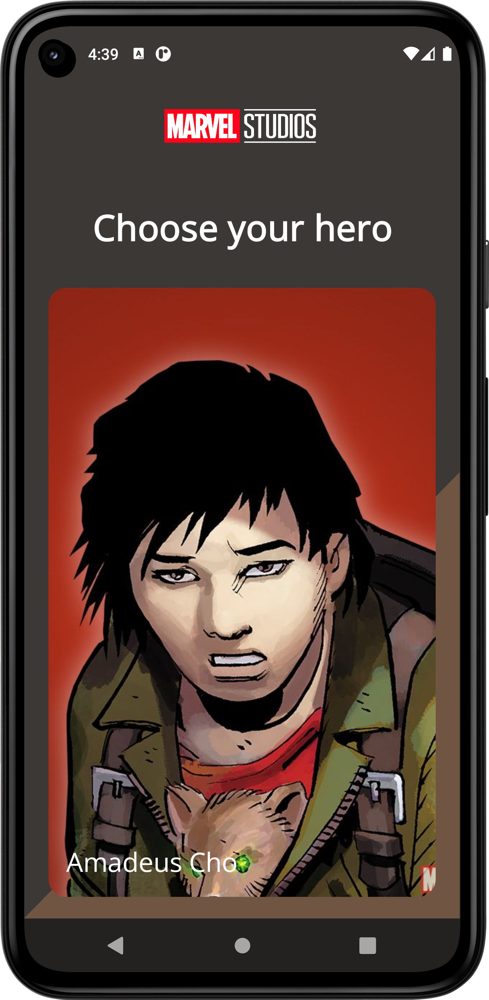
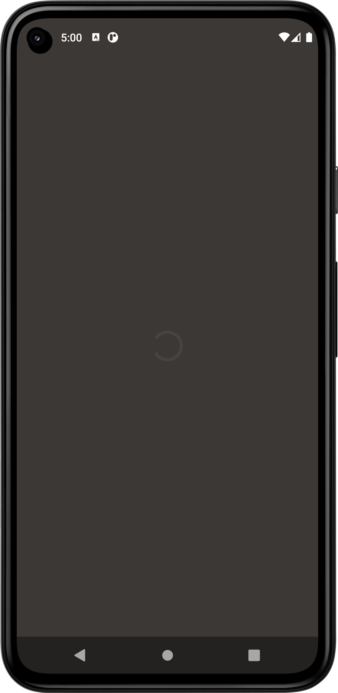
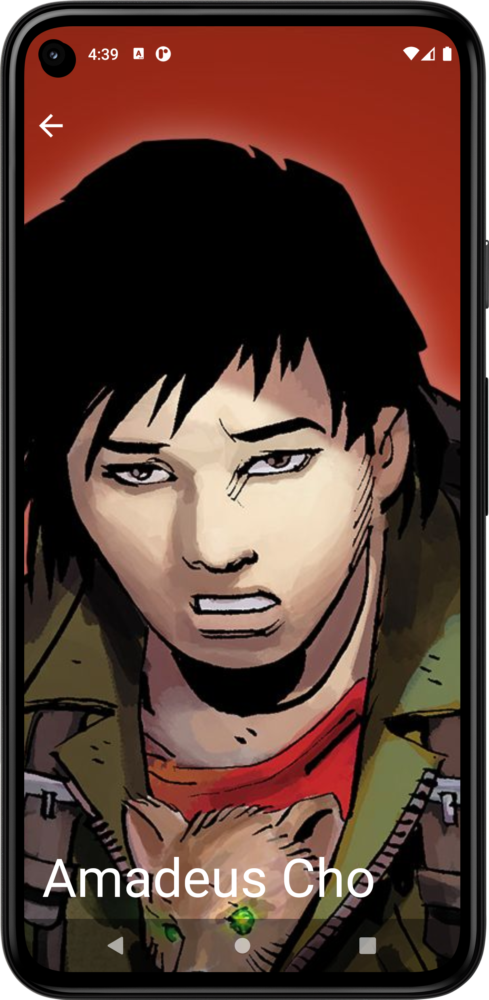

# MarvelApp

## Why i created this app
This is my study project. I've been practicing the basic concepts for android development on it

## Topics
* Navigation
* MVI
* Paging
* Theming
* Retrofit
* Room
* Compose Based UI

## Screenshots

### Main screens (In project SelectPersonScreen)

|                     Display                     |                      Loading                       |
|:-----------------------------------------------:|:--------------------------------------------------:|
|  |  |

### Hero screen

|                    Hero Screen                    |
|:-------------------------------------------------:|
|  |

## Used dependencies
* DI - [Hilt](https://dagger.dev/hilt/)
* Navigation - [Compose Destinations](https://github.com/raamcosta/compose-destinations)
* DataBase - [Room] (https://developer.android.com/jetpack/androidx/releases/room)
* Network - [Retrofit](https://github.com/square/retrofit)
* Network image - [Coil] (https://github.com/coil-kt/coil)

## How to run
* You need Android Studio (at least Arctic Fox) with Kotlin plugin (at least 1.6.21)
* Change the public and private key for the API in app/build.gradle -> defaultConfig
fields `publicKeyMarvel` and `privateKeyMarvel` (or leave the old values)
* Run -> Run 'app'

## My contact
Artem Gruzdev, myposhta.ruzdev@gmail.com
